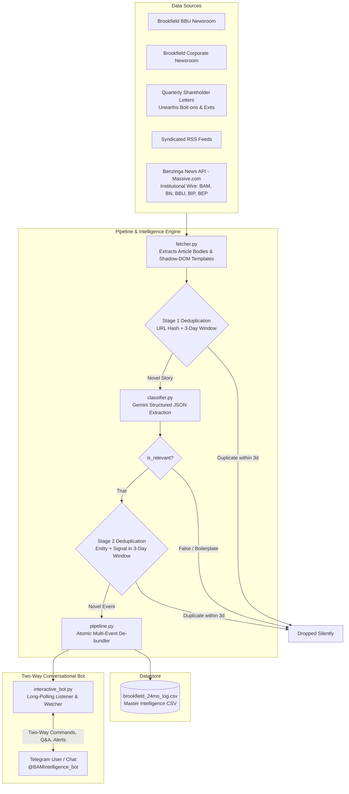

# Brookfield Private Equity Intelligence Pipeline & Interactive Telegram Bot

An autonomous private equity intelligence pipeline and two-way conversational Telegram bot (`@BAMIntelligence_bot`) tracking **Brookfield Asset Management (BAM, BBU, BIP, BEP)** dealflow, bolt-on acquisitions, divestitures, and quarterly shareholder letters.

Powered by **Google Generative AI (Gemini)**, the system de-bundles complex multi-deal releases into discrete records, enforces strict **Region-by-Asset** classification, deduplicates stories across a rolling 3-day window, appends intelligence to a master CSV log, pushes real-time deal alerts, and answers executive questions interactively in Telegram.

---

## Architecture Overview



---

## File Structure & Directory Map

| File | Purpose |
| :--- | :--- |
| **`interactive_bot.py`** | Two-way conversational Telegram bot. Handles slash commands, inline buttons, Gemini Q&A, and periodic monitoring sweeps. |
| **`daily_cron.py`** | Continuous scraper & monitor. Polls newsrooms, de-bundles deals, saves to CSV, and pushes deal alerts. |
| **`pipeline.py`** | Ingestion pipeline. Enforces 3-day rolling window deduplication, multi-event de-bundling, and writes to datastore. |
| **`classifier.py`** | Gemini classifier. Uses `gemini-flash-latest` with strict JSON schema and PE ontology (plus resilient fallback rule engine). |
| **`fetcher.py`** | Robust web scraper. Handles Brookfield's `<template shadowroot="open">` container to extract 100% of article bodies, letters, and RSS feeds. |
| **`config.py`** | Central configuration: models, endpoints, RSS feeds, rate limits (`4.0s`), and JSON extraction schemas. |
| **`api_manager.py`** | Secure credential loader. Reads `GEMINI_API_KEY`, `TELEGRAM_BOT_TOKEN`, and `TELEGRAM_CHAT_ID` from `.env`. |
| **`backfill.py`** | Historical 24-month backfill engine with rate-limit pacing and shareholder letter ingestion. |
| **`clean_datastore.py`** | Datastore sanitizer: normalizes dates, removes noisy prefixes/fragments, and deduplicates records. |
| **`setup_vm.sh`** | 1-click cloud VM deployment script. Installs Python, builds `.venv`, and creates `systemd` 24/7 service. |
| **`brookfield_24mo_log.csv`** | Master intelligence datastore containing 60 verified, de-bundled transactions. |
| **`test_pipeline.py`** | Test suite for scraping, deduplication, schema validation, and multi-event de-bundling (7 tests). |
| **`test_interactive_bot.py`** | Test suite for the interactive Telegram bot, query engine, Benzinga wire, deep dive generator, export, and digest (11 tests). |
| **`.env`** | Private credentials file (git-ignored for security). |
| **`.env.example`** | Safe template showing required environment variables. |

---

## Telegram Bot Commands & Usage Guide

Once running, you can interact with **`@BAMIntelligence_bot`** from your phone or desktop:

### ⚡ Fast Slash Commands
* **`/start`** or **`/help`** — Displays the command menu and system overview.
* **`/latest [N]`** — Shows the most recent $N$ deals (e.g., `/latest 5`). Displays headline, date, region, deal structure, size, and source link.
* **`/search <query>`** — Searches deals by keyword or company name (e.g., `/search Reliance` or `/search logistics`).
* **`/deals <region>`** — Filters transactions by target asset geography (e.g., `/deals Europe` or `/deals North America`).
* **`/exits`** — Lists recent Brookfield divestitures, secondary exits, and sales.
* **`/letters`** — Highlights recent Brookfield Letters to Shareholders and unearths portfolio company bolt-ons.
* **`/digest`** — Compiles and returns an executive morning briefing of recent dealflow, exits, and portfolio health.
* **`/wire [ticker]`** — Real-time Benzinga institutional wire for Brookfield entities (e.g., `/wire` or `/wire BAM`).
* **`/export`** — Uploads and delivers the raw `brookfield_24mo_log.csv` spreadsheet directly into your Telegram chat to open in Excel or Numbers.
* **`/stats`** — Generates a portfolio snapshot (total deals, breakdown by region, deal structures, and latest entry).
* **`/scan`** — Triggers an on-demand scraping and classification sweep immediately without waiting for the next scheduled interval.
* **`/status`** — Displays bot health, total records in the CSV log, and last sweep timestamp.

### 🌅 Automated Morning Briefing (8:00 AM)
The background daemon automatically compiles and dispatches an executive daily briefing to your Telegram chat every morning at **08:00 AM**, summarizing new M&A transactions, bolt-ons, exits, and leadership disclosures from the past 24–48 hours.

### 💬 Conversational Q&A (Powered by Gemini)
You can ask anything in plain English. The bot grounds its answers in `brookfield_24mo_log.csv` and replies with executive bullet points:
* *"What acquisitions did Brookfield make in Europe in the last 12 months?"*
* *"Tell me about the Reliance Worldwide transaction."*
* *"What did Bruce Flatt say about AI data centers in the shareholder letters?"*
* *"What carve-outs were executed this year?"*

### 🔘 Interactive Inline Action Buttons
Every deal alert pushed to Telegram includes interactive buttons underneath:
* **`[ 🔍 Deep Dive ]`** — Asks Gemini to generate a 3-bullet executive PE memo (Strategic Rationale & Fit, Deal Architecture & Valuation, and Operational Value Creation Angle).
* **`[ 📊 Similar Deals ]`** — Pulls other Brookfield investments in the same sector or geography.
* **`[ 🔗 View Source Release ]`** — Opens the primary press release or filing directly in your browser.

---

## Google Cloud VM Deployment Guide (24/7 Cloud Execution)

Deploying to a Google Cloud Virtual Machine allows your pipeline and Telegram bot to run 24/7/365 without keeping your Mac turned on.

### Step 1: Create a Free-Tier VM in Google Cloud Console
1. Log in to [Google Cloud Console](https://console.cloud.google.com/).
2. Select your project and navigate to **Compute Engine > VM instances**.
3. Click **Create Instance**:
   - **Name:** `brookfield-intelligence-vm`
   - **Region:** `us-central1` (Iowa) or `us-east1` (South Carolina) — *eligible for Google Cloud Always Free Tier*.
   - **Machine Type:** **`e2-micro`** (2 vCPUs, 1 GB memory — *Free Tier eligible*).
   - **Boot Disk:** **Ubuntu 22.04 LTS** (Standard persistent disk, 10-20 GB).
   - **Firewall:** Default settings are fine (no HTTP/HTTPS inbound needed, since Telegram uses outbound long polling).
4. Click **Create**.

---

### Step 2: Connect to your VM via SSH
Once the instance status is green, click the **SSH** button in the Google Cloud Console to open an in-browser Linux terminal.

---

### Step 3: Install Python & System Dependencies
Run the following commands in your VM terminal:
```bash
# Update package list and install Python 3, pip, and venv
sudo apt-get update
sudo apt-get install -y python3 python3-pip python3-venv git
```

---

### Step 4: Transfer Project Files to the VM
You can either clone your private repository or copy the project folder to the VM using `gcloud compute scp` from your Mac:

```bash
# Option A: Push to a private Git repository and clone on the VM:
git clone <your-private-repo-url> ~/brookfield-digest
cd ~/brookfield-digest

# Option B: Or copy directly from your Mac terminal using gcloud:
# gcloud compute scp --recurse "./" brookfield-intelligence-vm:~/brookfield-digest --zone=<your-vm-zone>
```

---

### Step 5: Configure Virtual Environment & Dependencies
On the VM, navigate to the folder and install requirements:
```bash
cd ~/brookfield-digest

# Create virtual environment
python3 -m venv .venv
source .venv/bin/activate

# Install dependencies
pip install --upgrade pip
pip install -r requirements.txt
```

---

### Step 6: Set Up Secrets in `.env`
Create your `.env` file on the VM:
```bash
nano .env
```
Paste your keys:
```env
GEMINI_API_KEY=your_actual_gemini_api_key
TELEGRAM_BOT_TOKEN=your_telegram_bot_token
TELEGRAM_CHAT_ID=your_telegram_chat_id
MASSIVE_BENZINGA_API_KEY=your_benzinga_api_key
```
Press `Ctrl + O`, then `Enter` to save, and `Ctrl + X` to exit.

---

### Step 7: Verify Functionality on the VM
Run the test suite to confirm everything is working:
```bash
source .venv/bin/activate
python test_pipeline.py
python test_interactive_bot.py
```

---

### Step 8: Set Up 24/7 Systemd Background Service
To ensure the bot starts on server boot and automatically restarts if it crashes, create a `systemd` service:

1. Create the service definition:
```bash
sudo nano /etc/systemd/system/brookfield-bot.service
```

2. Paste the following configuration (replace `<YOUR_USERNAME>` with your Linux username, usually your Google account name, or check with `whoami`):
```ini
[Unit]
Description=Brookfield PE Intelligence Telegram Bot & Monitor
After=network.target

[Service]
Type=simple
User=YOUR_USERNAME
WorkingDirectory=/home/YOUR_USERNAME/brookfield-digest
ExecStart=/home/YOUR_USERNAME/brookfield-digest/.venv/bin/python interactive_bot.py --interval 3600
Restart=always
RestartSec=10
Environment=PYTHONUNBUFFERED=1

[Install]
WantedBy=multi-user.target
```

3. Enable and start the service:
```bash
sudo systemctl daemon-reload
sudo systemctl enable brookfield-bot
sudo systemctl start brookfield-bot
```

4. Check the service status:
```bash
sudo systemctl status brookfield-bot
```

5. View real-time live logs:
```bash
journalctl -u brookfield-bot -f
```

Your bot is now running **24/7 in the cloud**!

---

## Updating & Syncing Code (Continuous Git Workflow)

Whenever you add new features, adjust scrapers, or tune prompts:

### 1. Push Updates from Mac:
```bash
git add .
git commit -m "Update feature or scraper"
git push
```

### 2. Pull Updates on your Google VM (Takes ~2 seconds):
Run this in your VM's SSH terminal:
```bash
cd ~/brookfield-digest && git pull && sudo systemctl restart brookfield-bot
```
The VM automatically downloads the changes and restarts the bot immediately with zero downtime.

---

## Local Development & Operations

### Running Locally on Mac

#### 1. Interactive Bot + Background Watcher
```bash
source .venv/bin/activate
python interactive_bot.py
```

#### 2. Run Single Monitoring Sweep
```bash
python daily_cron.py
```

#### 3. Test Telegram Alert Delivery
```bash
python daily_cron.py --test-telegram
```

#### 4. Run Historical 24-Month Backfill
```bash
python backfill.py --months 24
```

#### 5. Run Unit Tests
```bash
python test_pipeline.py
python test_interactive_bot.py
```

---

## Core Classification Rules

* **Region by Asset**: The primary geographic region strictly reflects the target company/asset location (e.g. Australian plumbing company Reliance Worldwide is `Asia Pacific`, never North America or sponsor HQ).
* **Multi-Event De-bundling**: Press releases containing multiple transactions (e.g. quarterly reports citing both an acquisition and a divestiture) are automatically split into distinct, atomic CSV records.
* **Rolling 3-Day Deduplication**: Pre-Gemini and post-Gemini deduplication filters out syndicated wire stories while preserving subsequent distinct developments.
* **Silently Dropping Noise**: Routine proxy announcements, conference call dials, and dividend declarations are classified as `is_relevant=False` and discarded without polluting the datastore.
